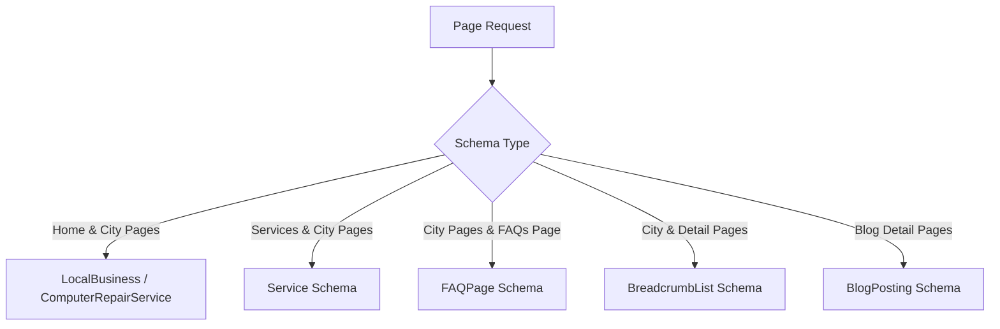

# Door2fy SEO & Technical Optimization Documentation

**Version:** 1.0  
**Date:** August 24, 2026  
**Status:** Implemented & Verified  
**Project:** Door2fy Web Platform (`door2fy.in`)

---

## 1. Executive Summary

A comprehensive technical and on-page SEO audit of Door2fy revealed several critical bottlenecks that prevented pages (particularly high-value city landing pages like Delhi, Nagpur, Noida, Bengaluru) from indexing and ranking on Google.

This document outlines all technical issues identified, the architectural solutions implemented, the automated static pre-rendering pipeline, structured schema implementation, and an actionable off-page roadmap.

---

## 2. Issues Identified vs. Solutions Implemented

| # | Issue Identified | Root Cause | Implemented Solution |
|---|-------------------|------------|----------------------|
| **1** | **Duplicate Metadata & Canonical Tags** | `index.html` had a hardcoded `<link rel="canonical" href="https://door2fy.in/" />`. All subpages were signaling Google to ignore themselves in favor of the homepage. | Created a centralized `<SEOHead>` component and removed the static canonical from `index.html`. Every route now has a unique canonical tag, title, and description. |
| **2** | **Invisible Content to Search Crawlers** | Single Page Application (SPA) rendered content strictly client-side via JavaScript; raw HTML fetched by crawlers was empty (`<div id="root"></div>`). | Built an automated post-build Static Pre-rendering generator (`scripts/generate-static-pages.ts`) creating 75 pre-rendered static HTML pages with full raw semantic HTML (`<h1>`, `<h2>`, FAQs, service descriptions). |
| **3** | **Keyword Invisibility ("doorstep laptop repair Delhi")** | City pages lacked keyword targeting in `<h1>`, body copy, local area clusters, and repair issue breakdowns. | Revamped `CityService.tsx` with primary H1 target keywords, 6 laptop issue categories, 5 interactive FAQs, and local area clusters for Delhi & 48+ cities. |
| **4** | **Missing Structured Data (Schema.org)** | Search engines lacked machine-readable data about business type, ratings, pricing, and FAQ accordions. | Injected Schema.org JSON-LD for `LocalBusiness` / `ComputerRepairService`, `Service`, `FAQPage`, `BreadcrumbList`, and `BlogPosting`. |
| **5** | **Asset URL Formatting (Space in Filename)** | OpenGraph image had a literal space (`/door2fy icon.jpg`), breaking previews on WhatsApp, LinkedIn, and crawler scrapers. | Renamed/copied asset to URL-safe `/door2fy-icon.jpg` and `/og-image.jpg`. Updated all references across the codebase. |

---

## 3. Technical Architecture & New Components

### A. Centralized SEO Head Component (`src/components/SEOHead.tsx`)
A unified wrapper built on top of `react-helmet-async` that dynamically controls page `<head>` metadata:

- **Canonical URL Enforcement:** Guarantees absolute, canonicalized URL formatting (`https://www.door2fy.in/...`).
- **Dynamic Meta Tags:** Unique `<title>`, `<meta name="description">`, and `<meta name="keywords">`.
- **OpenGraph & Twitter Cards:** Complete social preview tags referencing clean image paths.
- **Robots Directives:** Standardized `index, follow, max-image-preview:large`.
- **JSON-LD Schema Injection:** Injects structured data directly into `<head>`.

```tsx
<SEOHead
  title="Doorstep Laptop Repair in Delhi NCR | MacBook & PC Service - Door2fy"
  description="Need quick laptop repair in Delhi? Door2fy certified engineers arrive at your doorstep in 10-30 mins. Genuine parts, 90-day warranty, 5-min diagnosis."
  canonicalUrl="https://www.door2fy.in/best-laptop-service-in/delhi"
  keywords="doorstep laptop repair Delhi, laptop repair Delhi, MacBook repair Delhi"
  schema={citySchema}
/>
```

---

### B. Automated Static Pre-Rendering Pipeline (`scripts/generate-static-pages.ts`)
To solve the SPA crawler visibility problem without the overhead of maintaining a heavy Node server, a build-time pre-renderer was implemented:

1. Runs automatically on `npm run build` (`vite build && tsx scripts/generate-static-pages.ts`).
2. Takes `dist/index.html` as the base template.
3. Pre-renders **75 dedicated routes**:
   - Homepage (`/`)
   - Core pages (`/services`, `/why-us`, `/how-it-works`, `/faqs`, `/contact-us`, `/privacy-policy`, `/blogs`)
   - **48+ City Landing Pages** (`/best-laptop-service-in/delhi`, `/best-laptop-service-in/nagpur`, etc.)
   - **10 Service Detail Pages** (`/service/excel-not-working`, `/service/laptop-hanging-freezing`, etc.)
   - **All Blog Guides** (`/blog/laptop-repair-meerut`, `/blog/doorstep-laptop-repair-delhi`, etc.)
4. Bakes distinct `<title>`, `<meta name="description">`, `<link rel="canonical">`, Schema JSON-LD, and semantic HTML markup directly into `<div id="root">` inside each route's `index.html`.
5. Automatically compiles and outputs an updated, production-ready `public/sitemap.xml` and `dist/sitemap.xml`.

---

## 4. On-Page Keyword & Content Optimizations

### Targeted Keyword Clusters (Primary: Delhi & Major Metros)
- **Primary Keywords:**
  - `"doorstep laptop repair Delhi"`
  - `"laptop repair in Delhi"`
  - `"MacBook repair near me"`
  - `"laptop screen replacement Delhi"`
  - `"laptop service at home Delhi"`
- **City Page Content Enhancements (`src/pages/CityService.tsx`):**
  - **Hero Section:** `<h1>Doorstep Laptop Repair & Service in {City}</h1>` with 10–30 min guarantee.
  - **Local Area Coverage:** Micro-localities mapped per city (e.g., Delhi: *Nehru Place, Connaught Place, Dwarka, Rohini, Saket, South Ex, Janakpuri, Lajpat Nagar, Pitampura, Vasant Kunj*).
  - **Repair Issues Grid:** Screen replacement, battery repair, chip-level motherboard repair, NVMe SSD speed upgrades, liquid damage treatment, thermal paste & cooling fan service.
  - **Brand Support:** Apple MacBook (Air/Pro, M1/M2/M3), Dell, HP, Lenovo, ASUS, Acer, MSI, Samsung.
  - **Interactive FAQs:** 5 city-specific questions and answers covering arrival speed, warranty, genuine parts, pricing, and brands.

---

## 5. Structured Data (Schema.org) Summary

The following schemas are now active and verified:



### Key Schema Properties Configured:
1. **`LocalBusiness` / `ComputerRepairService`**:
   - `name`: "Door2fy - Doorstep Laptop Repair in {City}"
   - `image`: "https://www.door2fy.in/og-image.jpg"
   - `telephone`: "+91-8800000000"
   - `priceRange`: "₹₹"
   - `openingHoursSpecification`: 08:00 to 22:00 (All days)
   - `aggregateRating`: 4.9/5 from 42,700+ verified ratings
   - `areaServed`: Mapped dynamically per city.
2. **`FAQPage`**:
   - Validated Q&A pairs for Google FAQ rich snippet accordion display in search results.

---

## 6. Files Created & Modified

| File Path | Action | Description |
|-----------|--------|-------------|
| `src/components/SEOHead.tsx` | **NEW** | Centralized Helmet wrapper with canonical, meta, and JSON-LD schema handling. |
| `scripts/generate-static-pages.ts` | **NEW** | Post-build static generator creating 75 crawlable HTML pages and sitemap. |
| `index.html` | **MODIFIED** | Removed static global canonical fallback, fixed OG image paths without spaces. |
| `package.json` | **MODIFIED** | Added `tsx` dependency and updated build script to chain static generation. |
| `src/pages/CityService.tsx` | **MODIFIED** | Added hyper-local keywords, locality clusters, FAQs, and structured schemas. |
| `src/pages/Home.tsx` | **MODIFIED** | Added `SEOHead`, rich `LocalBusiness` and `Organization` schemas. |
| `src/pages/Services.tsx` | **MODIFIED** | Added unique meta and canonical URL. |
| `src/pages/ServiceDetails.tsx` | **MODIFIED** | Added dynamic `Service` schema and canonical URL. |
| `src/pages/WhyUs.tsx` | **MODIFIED** | Added unique meta and canonical URL. |
| `src/pages/HowItWorks.tsx` | **MODIFIED** | Added unique meta and canonical URL. |
| `src/pages/FAQs.tsx` | **MODIFIED** | Added dynamic `FAQPage` schema. |
| `src/pages/ContactUs.tsx` | **MODIFIED** | Added unique meta and canonical URL. |
| `src/pages/PrivacyPolicy.tsx` | **MODIFIED** | Added unique meta and canonical URL. |
| `src/pages/BlogList.tsx` | **MODIFIED** | Added dynamic meta and canonical URL. |
| `src/components/BlogDetail.tsx` | **MODIFIED** | Added dynamic `BlogPosting` schema and canonical URL. |
| `public/sitemap.xml` & `dist/sitemap.xml` | **UPDATED** | Automatically updated with all 75 URLs. |

---

## 7. Off-Page SEO & Local Ranking Action Plan

To dominate local search results (e.g. Local 3-Pack and organic rankings for *"doorstep laptop repair Delhi"*), follow these off-page steps:

### 1. Google Business Profile (GBP) Optimization
- **Primary Category:** `Computer Repair Service`
- **Secondary Categories:** `Laptop Repair Service`, `Data Recovery Service`, `Computer Support and Services`.
- **Service Areas:** Add Delhi, Noida, Gurugram, Ghaziabad, Faridabad, etc.
- **Attributes:** Highlight "Online appointments", "On-site services", "Same-day service".

### 2. NAP (Name, Address, Phone) Local Citations
Ensure 100% consistent business details across top Indian business directories:
- [JustDial](https://www.justdial.com/)
- [Sulekha](https://www.sulekha.com/)
- [IndiaMart](https://www.indiamart.com/)
- [TradeIndia](https://www.tradeindia.com/)
- [Bing Places for Business](https://www.bingplaces.com/)
- [Trustpilot](https://www.trustpilot.com/)

### 3. Review Acquisition Strategy
- Prompt satisfied customers to leave a 5-star Google review mentioning the keyword and city (e.g., *"Door2fy engineer repaired my MacBook screen in Nehru Place Delhi in 20 minutes"*).

---

## 8. Verification & Next Steps in Google Search Console

1. **Submit Sitemap in GSC:**
   - Go to Google Search Console -> **Sitemaps** -> Submit `https://www.door2fy.in/sitemap.xml`.
2. **Request Re-Indexing for Critical URLs:**
   - Use the **URL Inspection Tool** on:
     - `https://www.door2fy.in/`
     - `https://www.door2fy.in/best-laptop-service-in/delhi`
     - `https://www.door2fy.in/best-laptop-service-in/nagpur`
     - `https://www.door2fy.in/services`
   - Click **"Test Live URL"** -> Confirm that the raw HTML contains the unique title, canonical tag, and headings -> Click **"Request Indexing"**.
3. **Rich Results Test:**
   - Test URLs on [Google Rich Results Test](https://search.google.com/test/rich-results) to verify `LocalBusiness` and `FAQPage` schemas are recognized without errors.
